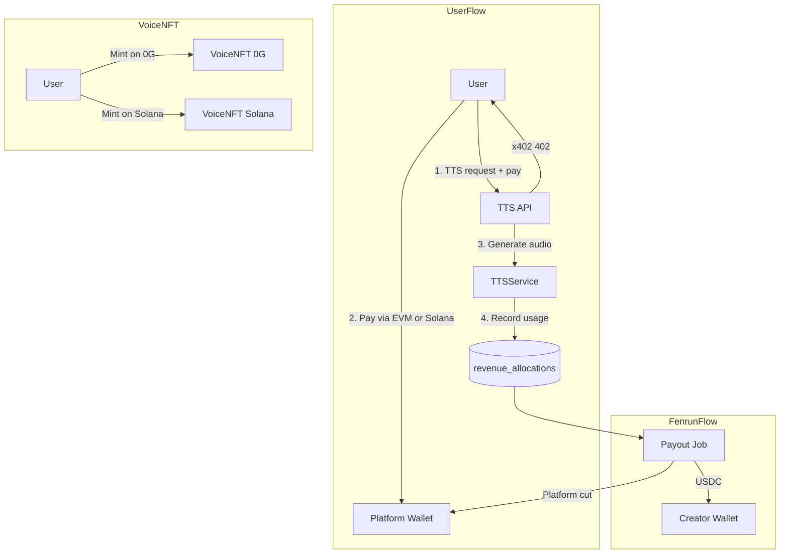

# Solana Chain and x402 Revenue Sharing Plan

## Current State

- **TTS payments**: [backend/src/routes/tts.ts](backend/src/routes/tts.ts) uses `x402-express` (legacy) with single receiver, Base Sepolia only
- **Frontend client**: [frontend/src/api/client.ts](frontend/src/api/client.ts) uses `x402-axios` + viem for EVM payment handling
- **Voice NFT**: [frontend/src/components/VoiceNFTMint.tsx](frontend/src/components/VoiceNFTMint.tsx) mints on 0G Galileo Testnet (EVM) via ethers.js + MetaMask
- **Voice model**: [backend/src/storage/memoryStorage.ts](backend/src/storage/memoryStorage.ts) has `userId` (creator) but no wallet address for payouts

---

## Architecture Overview



---

## Part 1: Add Solana to x402 TTS Payments

### 1.1 Backend - Migrate to Official x402 SDK

**Replace** `x402-express` with official packages:
- `@x402/express`
- `@x402/core`
- `@x402/evm`
- `@x402/svm` (Solana)

**Refactor** [backend/src/routes/tts.ts](backend/src/routes/tts.ts):
- Use `x402ResourceServer`, `HTTPFacilitatorClient`, `paymentMiddleware`
- Register both `ExactEvmScheme` and `ExactSvmScheme`
- Configure `accepts` with two options:
  - EVM: `eip155:84532` (Base Sepolia), `payTo`: platform EVM address
  - SVM: `solana:EtWTRABZaYq6iMfeYKouRu166VU2xqa1` (Solana Devnet), `payTo`: platform Solana address

**Env vars**: `PLATFORM_EVM_ADDRESS`, `PLATFORM_SOLANA_ADDRESS`, `FACILITATOR_URL` (testnet: `https://x402.org/facilitator`)

### 1.2 Frontend - Support Solana Wallet for x402

**Dependencies**: Add Solana wallet adapter for Phantom (e.g. `@solana/wallet-adapter-react`, `@solana/wallet-adapter-wallets`).

**Challenge**: `x402-axios` and viem wallet client are EVM-only. The x402 buyer flow requires a wallet that can sign payments for the chosen network. Options:
1. Check if `@coinbase/x402` provides a unified client that supports both EVM and SVM
2. Or: Add network selection UI before TTS; use EVM client for Base or SVM client for Solana based on user choice

**Update** [frontend/src/api/client.ts](frontend/src/api/client.ts):
- Add Solana to `CHAIN_MAP` / network config
- Support Phantom (window.solana) for Solana payments when user selects Solana
- Ensure 402 handler can sign with either EVM or Solana wallet based on PAYMENT-REQUIRED header's `accepts` list

---

## Part 2: x402 Revenue Sharing (分润)

### 2.1 Data Model Changes

**Voice** (in [backend/src/storage/memoryStorage.ts](backend/src/storage/memoryStorage.ts)):
- Add `creatorEvmAddress?: string` – creator's EVM wallet for payouts
- Add `creatorSolanaAddress?: string` – creator's Solana wallet for payouts

**New table / storage**: `revenue_allocations`
- `id`, `ttsRequestId`, `voiceId`, `creatorUserId`
- `amountPaidUsd` (e.g. 0.01)
- `creatorShareUsd` (e.g. 0.007 for 70%)
- `platformShareUsd` (e.g. 0.003 for 30%)
- `creatorWalletAddress`, `creatorWalletChain` (evm | solana)
- `status`: `pending` | `paid`
- `paidAt?: Date`

### 2.2 Backend Logic

**TTSService** ([backend/src/services/ttsServiceMemory.ts](backend/src/services/ttsServiceMemory.ts)):
- After `recordUsage`, call new `revenueService.allocate(voiceId, amountUsd)`
- Get voice → creator userId, creator wallet address
- Compute split: `creatorShare = amount * CREATOR_SHARE_PCT`, `platformShare = amount * PLATFORM_SHARE_PCT`
- Insert `revenue_allocations` row with status `pending`

**New service**: `revenueService.ts`
- `allocate(voiceId, amountUsd)` – create allocation record
- `getPendingAllocations(creatorUserId?)` – list pending payouts
- `executePayout(allocationId)` – send creator share via USDC transfer (EVM: viem/ethers, Solana: @solana/web3.js + SPL token)

**Payout options**:
- **Option A**: Cron job (e.g. daily) processes `status=pending`, batches and sends USDC to creator wallets
- **Option B**: Admin endpoint to trigger payout manually
- **Option C**: Real-time: on each TTS, immediately send creator share (higher gas/tx cost)

Recommend **Option A** for cost efficiency.

**Env vars**: `CREATOR_SHARE_PCT` (e.g. 70), `PLATFORM_SHARE_PCT` (30), `TTS_PRICE_USD` (e.g. 0.01)

### 2.3 Creator Wallet Registration

**API**: Add `PATCH /voices/:id` (or extend existing update) to set `creatorEvmAddress` / `creatorSolanaAddress` when creator links wallet.

**UI**: On CreateVoice or VoiceDetail, add optional "Link payout wallet" – creator enters EVM or Solana address. If not set, allocation stays pending until they link.

---

## Part 3: Voice NFT on Solana

### 3.1 Solana Voice NFT Approach

Use **Metaplex** (standard Solana NFT) rather than a custom program:
- Simpler: no Anchor/Rust deployment
- Metadata: `voiceId`, `embeddingHash` in attributes (same as current EVM NFT)

**Dependencies**: `@metaplex-foundation/mpl-token-metadata`, `@solana/web3.js`, `@solana/wallet-adapter-base`

### 3.2 Frontend Changes

**New config**: [frontend/src/config/web3.ts](frontend/src/config/web3.ts) – add `SOLANA_CONFIG` (cluster: devnet/mainnet, metadata program ID, etc.)

**VoiceNFTMint component**:
- Add chain selector: "Mint on 0G" vs "Mint on Solana"
- For 0G: keep existing ethers + MetaMask flow
- For Solana:
  - Use `@solana/wallet-adapter-react` (Phantom)
  - Create NFT via Metaplex: upload JSON metadata (voiceId, embeddingHash), mint SPL token with metadata
  - Show mint tx signature / explorer link

**Manage & Restore tab**: For Solana NFTs, read metadata from chain (Metaplex) to get voiceId/embeddingHash. May need separate UI branch for EVM vs Solana.

### 3.3 Optional: Solana Program (Advanced)

If you prefer a dedicated program (like EVM contract):
- Deploy Anchor program with `mint(voice_id, embedding_hash)` and `get_voice_data(token_id)`
- More control but higher effort; Metaplex is sufficient for MVP.

---

## Implementation Order

1. **Backend x402**: Migrate to @x402/*, add Solana accepts (Part 1.1)
2. **Revenue model**: Add Voice wallet fields, revenue_allocations, allocate() in TTSService (Part 2.1–2.2)
3. **Frontend x402**: Add Solana wallet + network choice for TTS payment (Part 1.2)
4. **Creator wallet UI**: Allow creators to link payout address (Part 2.3)
5. **Payout job**: Implement executePayout + cron (Part 2.2)
6. **Voice NFT Solana**: Add Metaplex mint flow in VoiceNFTMint (Part 3)

---

## Key Files to Modify

| Area | Files |
|------|-------|
| Backend x402 | `backend/package.json`, `backend/src/routes/tts.ts`, `backend/src/index.ts` (wire x402 server) |
| Revenue | `backend/src/storage/memoryStorage.ts`, `backend/src/services/ttsServiceMemory.ts`, new `revenueService.ts`, new `revenueRoutes.ts` |
| Voice wallet | `backend/src/routes/voices.ts`, `frontend/src/api/voices.ts`, `CreateVoice.tsx` / `VoiceDetail.tsx` |
| Frontend x402 | `frontend/package.json`, `frontend/src/api/client.ts` |
| Voice NFT Solana | `frontend/package.json`, `frontend/src/config/web3.ts`, `frontend/src/components/VoiceNFTMint.tsx` |

---

## Environment Variables Summary

```env
# x402 Multi-Network
PLATFORM_EVM_ADDRESS=0x...
PLATFORM_SOLANA_ADDRESS=...
FACILITATOR_URL=https://x402.org/facilitator
TTS_PRICE_USD=0.01

# Revenue Sharing
CREATOR_SHARE_PCT=70
PLATFORM_SHARE_PCT=30

# Solana (optional for NFT)
SOLANA_CLUSTER=devnet
```
